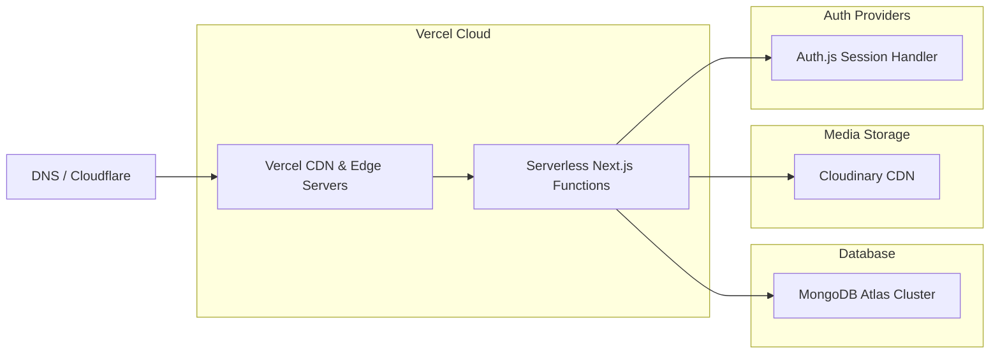

# WorkForce Pro: SaaS Product & Deployment Architecture

This document describes the production-ready architecture design for **WorkForce Pro**, a multi-tenant Contractor Worker Management platform.

---

## 1. Multi-Tenant SaaS Architecture

WorkForce Pro uses **Shared Database, Shared Schema (Logical Data Isolation)**. This pattern is chosen for optimal resource utilization, low administrative overhead, and seamless scaling on MongoDB Atlas.

```mermaid
graph TD
    subgraph Client Tier
        C1[Contractor / Admin UI]
        C2[Accountant UI]
        C3[Supervisor UI]
    end

    subgraph Application Tier (Vercel Serverless)
        NG[Next.js App Router]
        MW[Auth Middleware: Session & RBAC Verification]
        SA[Server Actions & Route Handlers]
    end

    subgraph Data & Storage Tier
        DB[(MongoDB Atlas - Shared Cluster)]
        T1[(Tenant A Collections)]
        T2[(Tenant B Collections)]
        CL[(Cloudinary Object Store)]
    end

    C1 --> NG
    C2 --> NG
    C3 --> NG
    NG --> MW
    MW --> SA
    SA --> DB
    SA --> CL
    DB -.-> T1
    DB -.-> T2
```

### Multi-Tenancy Logic & Data Isolation
* **Tenant Scoping:** Every document in tenant-scoped collections (User, Worker, Project, Attendance, Advance, Expense, Ledger, Payroll) contains a mandatory `tenantId` field linking to the `Tenant` collection.
* **Session Resolution:** When a user logs in, their verified session (managed via Auth.js JWT) caches their name, email, role, and `tenantId`.
* **Tenant Query Enforcement:** All backend database queries (Server Actions or Next.js API Route Handlers) must programmatically append `{ tenantId: session.user.tenantId }` to the filter criteria.
  
> [!CAUTION]
> **Query Leakage Prevention:** Do not build dynamic query parameters directly from user request bodies. Always bind the `tenantId` strictly from the server-validated session context (`req.auth.user.tenantId` or `auth()`).

---

## 2. Deployment Architecture

WorkForce Pro is optimized for a serverless execution model, ensuring low idle costs and rapid scale-to-zero capabilities.



### Infrastructure Components

1. **Frontend & Server Functions (Vercel):**
   * Next.js pages and API route handlers compile into Serverless/Edge Functions.
   * Auto-scaling is managed out-of-the-box by Vercel.
   * **Optimized Connection Pooling:** MongoDB connections are cached outside the handler execution loop via a cached connection module (`lib/dbConnect.js`).

2. **Database Cluster (MongoDB Atlas):**
   * Configured as a multi-region replica set (M0/M10 shared or serverless instances) to guarantee high availability (99.9%).
   * Encrypted at rest (AES-256) and in transit (TLS/SSL).
   * **Daily Backups:** Point-in-time recovery (PITR) enabled for disaster recovery.

3. **Storage Engine (Cloudinary):**
   * Used for storing worker profile photos and expense receipt scans.
   * Direct-to-Cloudinary signed uploads from the frontend reduce Next.js memory usage and execution time.
   * Automatic image optimization (WebP/AVIF compression) and CDN delivery.

4. **Authentication & Session Management (Auth.js / NextAuth v5):**
   * Uses JWT-based sessions stored in secure, HTTP-only, double-keyed cookies.
   * CSRF protection enabled by default.

---

## 3. Role-Based Access Control (RBAC)

The application implements a strict role hierarchy mapped to specific platform actions.

| User Role | Target Audience | Permissions Scope | Key Use Cases |
| :--- | :--- | :--- | :--- |
| **Contractor (Admin)** | Construction Company Owners, Builders, Contractors | Full read/write access to all collections and configurations within their Tenant. | Management of staff, projects, budgets, payroll, settings, and billing. |
| **Accountant** | In-house or External Bookkeepers, Financial Clerks | Read-only access to workers and attendance. Full write access to payroll, expenses, and ledgers. | processing weekly wage disbursements, issuing ledger updates, logging invoices. |
| **Supervisor** | Site Managers, Foremen, Factory Supervisors | Read-only access to assigned workers. Write access ONLY for logging daily attendance. | Marking daily attendance logs, viewing assigned project worker list. |

### Access Control Architecture
Access controls are enforced at three distinct layers:

1. **Edge Middleware Route Guards:** Checks incoming HTTP requests against a path mapping registry to quickly reject unauthorized routing (e.g. blocking a supervisor from accessing `/payroll/*`).
2. **Server Action & Route Handler level authorization:** Double-check role context inside database calls before executing mutations.
3. **UI Conditionally Rendered Blocks:** Elements (like "Delete Worker" or "Generate Salary Settlement") are hidden or disabled on the client-side based on the current user's role payload, preventing UI confusion.
