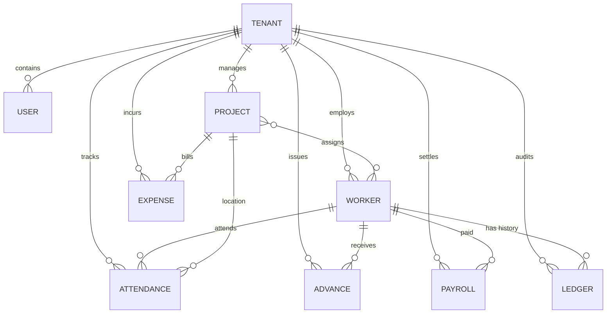
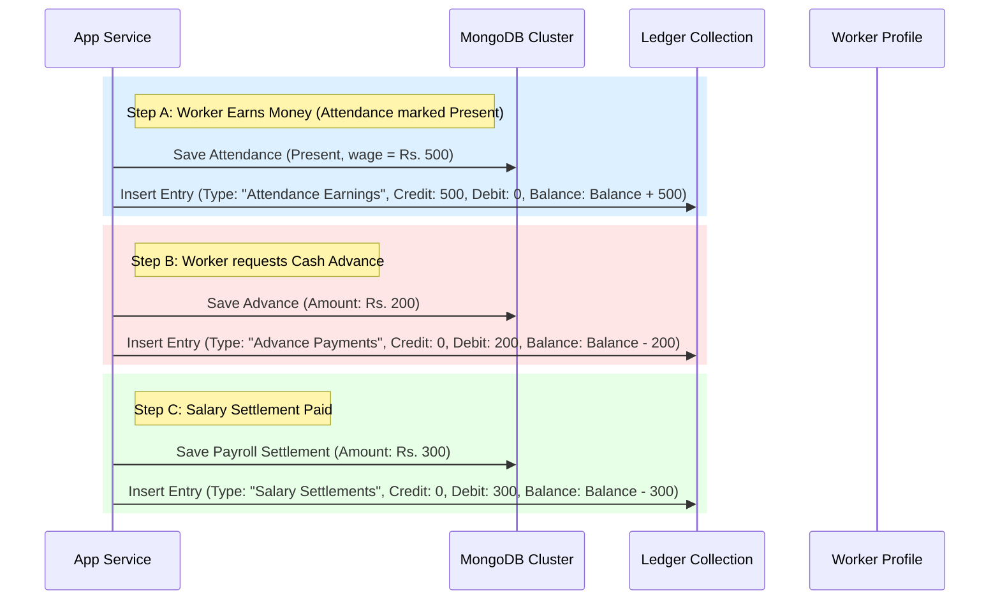

# WorkForce Pro: MongoDB Database Design & Ledger Flow

This document details the database schema architecture, collection relationship mapping, indexing strategy, and transactional ledger mechanism for **WorkForce Pro**.

---

## 1. Entity-Relationship Model (ERD)

The database design uses a reference-based model optimized for document databases. 



### Collection Relationship Rules

1. **Multi-Tenant Scoping:** Every entity contains a reference field `tenantId` pointing to the `Tenant` schema.
2. **Project Worker Association:** Projects store an array of Worker references (`assignedWorkers`). Workers can be assigned to multiple projects simultaneously.
3. **Attendance Binding:** Daily attendance logs require both a `workerId` and a `projectId`. This ensures wage costs are accurately aggregated against the specific project's cost center.
4. **Passbook Ledger System:** A centralized `Ledger` collection tracks all financial movements. It links to transactions (Attendance, Advance, Payroll) using Mongoose dynamic references (`refPath`).

---

## 2. Indexing Strategy

Indexing is critical in a multi-tenant shared database. By creating compound indexes starting with `tenantId`, MongoDB ensures query isolation and high-speed execution.

| Collection | Index Fields | Purpose | Options |
| :--- | :--- | :--- | :--- |
| **Tenant** | `{ email: 1 }` | Fast verification during signup | `{ unique: true }` |
| **User** | `{ email: 1 }` | NextAuth user login verification | `{ unique: true }` |
| **User** | `{ tenantId: 1, role: 1 }` | Fast role authorization check | - |
| **Worker** | `{ tenantId: 1, aadhaarNumber: 1 }` | Uniqueness of worker identification within the tenant | `{ unique: true }` |
| **Worker** | `{ tenantId: 1, name: 1 }` | Autocomplete / search filtration by name | - |
| **Worker** | `{ tenantId: 1, status: 1 }` | Filtering active / inactive workers | - |
| **Attendance** | `{ tenantId: 1, workerId: 1, date: 1 }` | Prevent duplicate logs for same worker on same date | `{ unique: true }` |
| **Attendance** | `{ projectId: 1, date: 1 }` | Aggregating project labor cost by date range | - |
| **Advance** | `{ tenantId: 1, workerId: 1, date: -1 }` | Fetching worker advance logs chronologically | - |
| **Expense** | `{ tenantId: 1, category: 1, date: -1 }` | Categorized expense trend analytics | - |
| **Expense** | `{ projectId: 1, date: -1 }` | Project cost tracking | - |
| **Ledger** | `{ tenantId: 1, workerId: 1, date: 1 }` | Building worker passbook in chronological order | - |
| **Ledger** | `{ tenantId: 1, workerId: 1, referenceId: 1 }` | Prevent double-posting of a transaction to ledger | `{ unique: true }` |
| **Payroll** | `{ tenantId: 1, workerId: 1, periodEnd: -1 }` | Retrieving worker settlement history | - |

---

## 3. Worker Ledger Flow (Audit Ledger Engine)

To resolve the core problems of tracking worker wages, outstanding balances, and loans, WorkForce Pro implements a **Double-Entry Ledger engine** analogous to traditional bank passbooks.



### Ledger Entry Fields Definition:
* **Credit:** Income earned by the worker (Wages). Increases the running balance.
* **Debit:** Funds disbursed to the worker (Advances, Salary payouts). Decreases the running balance.
* **Balance:** Outstanding balance. `Outstanding = (Previous Outstanding) + Credit - Debit`.
  * **Positive Balance:** Company owes money to the worker.
  * **Negative Balance:** Worker owes money to the company (due to excess advances).

### Operational Workflow for Mutations

When updating financial states, operations are wrapped in a **MongoDB Session Transaction** to ensure atomicity.

#### Algorithm: Marking Attendance
1. Create `Attendance` document. Calculate `wageEarned` based on status (Present = full wage, Half-day = 50%, Absent = 0).
2. Fetch the latest `Ledger` entry for the worker to get the current `balanceAfter`. If no entry exists, current balance is 0.
3. Calculate `newBalance = latestBalance + wageEarned`.
4. Create `Ledger` document:
   * `credit` = `wageEarned`
   * `debit` = 0
   * `balanceAfter` = `newBalance`
   * `referenceId` = `Attendance._id`
   * `referenceModel` = `'Attendance'`

#### Algorithm: Issuing an Advance
1. Create `Advance` document with `amount`.
2. Fetch the latest `Ledger` entry for the worker.
3. Calculate `newBalance = latestBalance - amount`.
4. Create `Ledger` document:
   * `credit` = 0
   * `debit` = `amount`
   * `balanceAfter` = `newBalance`
   * `referenceId` = `Advance._id`
   * `referenceModel` = `'Advance'`

#### Algorithm: Processing Salary Settlement
1. Create `Payroll` document containing pay period details, calculated earnings (aggregated from attendance), advances deducted, and actual `netAmountPaid`.
2. Fetch the latest `Ledger` entry for the worker.
3. Calculate `newBalance = latestBalance - netAmountPaid`.
4. Create `Ledger` document:
   * `credit` = 0
   * `debit` = `netAmountPaid`
   * `balanceAfter` = `newBalance`
   * `referenceId` = `Payroll._id`
   * `referenceModel` = `'Payroll'`

### Key Architecture Benefit
Instead of executing CPU-intensive summation queries (`$sum` of all attendance minus `$sum` of all advances and payments) whenever a contractor opens the worker list, the app retrieves the single most recent ledger document for the worker:
```javascript
const latestLedger = await Ledger.findOne({ tenantId, workerId })
                                   .sort({ date: -1, createdAt: -1 })
                                   .lean();
const outstandingBalance = latestLedger ? latestLedger.balanceAfter : 0;
```
This reduces database load from **O(N) to O(1)** (constant time lookup), providing immediate response times on mobile devices.
